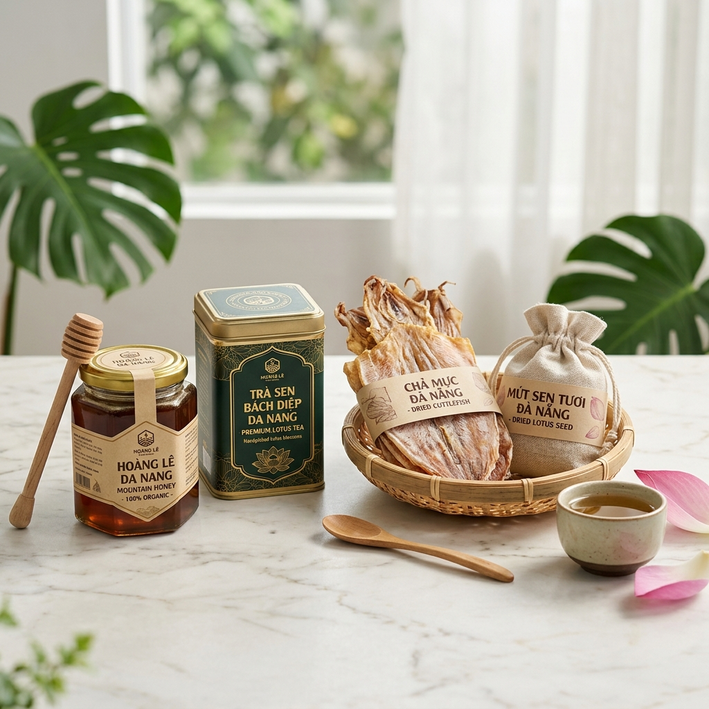
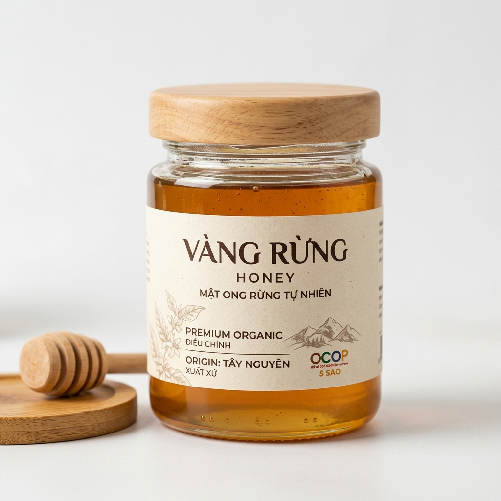

# Danangtrade UI/UX Redesign Walkthrough

I have completely redesigned the Danangtrade homepage based on your specifications. The new design focuses on a **minimalist, premium e-commerce experience** while maintaining the website's core identity as a government-backed OCOP marketplace.

````carousel
### 📊 Design Analysis
I identified several friction points in the legacy design:
*   **Visual Noise:** Double branding and cluttered sidebars.
*   **Low Contrast:** Harsh red/orange gradients.
*   **Confusing Hierarchy:** Categories were hidden in a vertical list.

**The Solution:**
*   Horizontal grid categories for instant scanability.
*   "Glassmorphism" header for a modern tech feel.
*   Balanced white space to reduce cognitive load.

<!-- slide -->

### 🎨 New Design System
I've implemented a refreshed palette that is softer on the eyes:
*   **Primary:** #FF6B00 (Clean Orange)
*   **Base:** #FFFFFF & #F8F9FA (Crisp White & Light Gray)
*   **Typography:** Outfit (Headings) & Inter (Body)
*   **Components:** Soft rounded corners (12px), subtle shadows, and micro-animations.

<!-- slide -->

### 📸 Premium Visual Assets
I generated high-resolution, professional product photography to replace generic stock images:

*Modern Hero Banner featuring OCOP specialties.*

<!-- slide -->

### 🛍️ Product Experience
Enhanced product cards with:
*   **OCOP Star Badges:** Highlighting certification levels.
*   **Interactive CTAs:** Smooth hover states and cart feedback.
*   **Clean Pricing:** Clear differentiation between sale and regular prices.


*Redesigned Product Card showcase.*
````

## 🖱️ Interactive Mockup
The full redesign is available in the generated code files:
*   [index.html](file:///C:/Users/ANH%20VU/.gemini/antigravity/brain/ebe028eb-85cc-4fa5-a67b-54bfd8e42c3e/index.html)
*   [styles.css](file:///C:/Users/ANH%20VU/.gemini/antigravity/brain/ebe028eb-85cc-4fa5-a67b-54bfd8e42c3e/styles.css)
*   [script.js](file:///C:/Users/ANH%20VU/.gemini/antigravity/brain/ebe028eb-85cc-4fa5-a67b-54bfd8e42c3e/script.js)

### Key Improvements:
1.  **Hero Carousel:** Replaced the static/cluttered top section with a high-impact, clean carousel.
2.  **Modern Category Bar:** Replaced the left sidebar with a category grid featuring custom icons.
3.  **Trust Elements:** Integrated OCOP badges and a professional footer with government information.
4.  **Conversion Focus:** Prominent search, sticky header, and clear "Add to Cart" logic.
